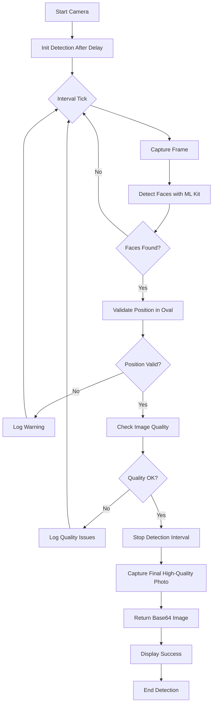

# Biometric Face Detection Scanner

A high-quality facial recognition system for React Native using ML Kit face detection. This module provides continuous face detection with quality validation and position checking, designed for integration with AWS Rekognition or similar biometric APIs.

## 📋 Table of Contents

- [Overview](#overview)
- [Architecture](#architecture)
- [Features](#features)
- [How It Works](#how-it-works)
- [Configuration](#configuration)
- [Usage](#usage)
- [API Reference](#api-reference)
- [Image Quality Validation](#image-quality-validation)
- [Face Position Validation](#face-position-validation)

---

## Overview

The biometric scanner continuously monitors the camera feed, validates face position and quality, and captures a high-resolution Base64 image when all conditions are met. The system automatically stops detection once a valid face is captured.

### Key Capabilities

- ✅ **Continuous Detection**: Monitors camera feed at configurable intervals
- ✅ **Quality Validation**: Checks head orientation and eye openness
- ✅ **Position Validation**: Ensures face is centered within the scanner oval
- ✅ **Base64 Output**: Returns image ready for API transmission
- ✅ **Auto-Stop**: Stops detection after successful capture
- ✅ **Motion Blur Prevention**: Validates image stability

---

## Architecture

```
┌─────────────────────────────────────────────────────────────┐
│                   BiometricsScanner (UI)                    │
│  - Renders CameraView & Overlay                             │
│  - Handles permissions                                       │
│  - Displays success state                                    │
└────────────────────────┬────────────────────────────────────┘
                         │
                         ▼
┌─────────────────────────────────────────────────────────────┐
│              useFaceDetection Hook                          │
│  - Manages detection lifecycle                              │
│  - Returns: { capturedImage }                               │
│  - Callbacks: onDetectionComplete                           │
└────────────────────────┬────────────────────────────────────┘
                         │
                         ▼
┌─────────────────────────────────────────────────────────────┐
│          Continuous Detection (Core Logic)                  │
│  ┌───────────────────────────────────────────────────────┐  │
│  │  1. captureAndDetectFaces()                           │  │
│  │     - Takes photo                                     │  │
│  │     - Runs ML Kit face detection                     │  │
│  │                                                       │  │
│  │  2. filterValidFaces()                               │  │
│  │     - Validates face position in oval                │  │
│  │     - Checks centering & size                        │  │
│  │                                                       │  │
│  │  3. checkImageQuality()                              │  │
│  │     - Validates head angles (rotationX/Y/Z)         │  │
│  │     - Checks eye openness                            │  │
│  │                                                       │  │
│  │  4. captureFinalPhoto()                              │  │
│  │     - Captures high-quality image with Base64        │  │
│  │     - Returns { uri, width, height, base64 }         │  │
│  │                                                       │  │
│  │  5. stopDetection()                                   │  │
│  │     - Clears detection interval                      │  │
│  └───────────────────────────────────────────────────────┘  │
└─────────────────────────────────────────────────────────────┘
```

---

## Features

### 1. **Automatic Detection**
Continuously scans for faces at configurable intervals (default: 1 second).

### 2. **Quality Checks**
- **Head Orientation**: Validates that rotation angles are within ±15°
  - `rotationX` (Pitch): Up/down tilt
  - `rotationY` (Yaw): Left/right turn  
  - `rotationZ` (Roll): Side tilt
- **Eye State**: Ensures both eyes are open (>30% probability)
- **Motion Blur**: Prevents capturing during movement

### 3. **Position Validation**
- **Centering**: Face must be centered horizontally (±15%) and vertically (±20%)
- **Size**: Face must occupy 30-85% of frame dimensions
- **Oval Boundary**: Face must be within the scanner oval overlay

### 4. **High-Quality Output**
- Image quality: 0.8 (80%)
- Full resolution with Base64 encoding
- Ready for API transmission (AWS Rekognition, etc.)

---

## How It Works

### Detection Flow



### Step-by-Step Process

1. **Initialization** (500ms delay)
   - Allows camera to stabilize
   - Initializes detection context

2. **Continuous Scanning** (1000ms intervals)
   - Captures frame from camera
   - Processes with ML Kit face detection
   - Returns detected faces with metadata

3. **Position Validation**
   - Calculates face center coordinates
   - Compares with scanner oval boundaries
   - Filters out faces outside oval

4. **Quality Validation**
   - Checks head rotation angles
   - Validates eye openness
   - Ensures stability (no blur)

5. **Final Capture**
   - Stops detection interval immediately
   - Captures high-quality photo with Base64
   - Returns image data

6. **Completion**
   - Displays success indicator
   - Image ready for API transmission

---

## Configuration

### `config.ts`

```typescript
export const timingConfig = {
    cameraInitDelay: 500,      // Initial delay before detection starts
    detectionInterval: 1000,   // Interval between detections (ms)
} as const;

export const defaultPhotoCaptureOptions = {
    quality: 0.8,              // Image quality (0-1)
    base64: true,              // Include Base64 in output
};

export const defaultFaceDetectionOptions = {
    performanceMode: 'accurate',  // 'fast' | 'accurate'
    landmarkMode: 'all',          // Face landmarks detection
    contourMode: 'all',           // Face contours detection
    classificationMode: 'all',    // Eye/smile classification
    minFaceSize: 0.05,           // Minimum face size (5% of image)
};

export const scannerDimensions = {
    width: 280,                  // Scanner oval width
    height: 360,                 // Scanner oval height
    distanceFromTop: 0.35,       // Position from top (35%)
} as const;
```

### Quality Thresholds

```typescript
// In continuous-detection.ts
const maxHeadAngle = 15;        // Maximum rotation angle (degrees)
const minEyeOpenProbability = 0.3;  // Minimum eye openness (30%)

// In validate-face-position.ts
const maxDeviationX = 0.15;     // Horizontal centering tolerance (15%)
const maxDeviationY = 0.20;     // Vertical centering tolerance (20%)
const minFaceSize = 0.3;        // Minimum face size ratio (30%)
const maxFaceSize = 0.85;       // Maximum face size ratio (85%)
```

---

## Usage

### Basic Implementation

```tsx
import { useFaceDetection } from "@/modules/biometrics/use-face-detection";
import { CameraView } from "expo-camera";
import { useRef, useState } from "react";

export default function BiometricsScanner() {
    const cameraRef = useRef<any>(null);
    const [isCaptureDone, setIsCaptureDone] = useState(false);

    const { capturedImage } = useFaceDetection(cameraRef, {
        enabled: !isCaptureDone,
        validatePosition: true,
        onDetectionComplete: (image) => {
            setIsCaptureDone(true);
            
            // Send to your API
            if (image.base64) {
                sendToRekognition(image.base64);
            }
        },
    });

    return (
        <CameraView ref={cameraRef} facing="front" />
    );
}
```

### With Custom Configuration

```tsx
const { capturedImage } = useFaceDetection(cameraRef, {
    enabled: hasPermission && !isCaptureDone,
    intervalMs: 2000,              // Check every 2 seconds
    initDelayMs: 1000,             // Wait 1 second before starting
    validatePosition: true,         // Enable position validation
    onDetectionComplete: (image) => {
        console.log('Image captured:', {
            uri: image.uri,
            size: `${image.width}x${image.height}`,
            base64Length: image.base64?.length,
        });
    },
});
```

---

## API Reference

### `useFaceDetection(cameraRef, options)`

Main hook for face detection functionality.

#### Parameters

```typescript
interface UseFaceDetectionOptions {
    enabled?: boolean;                           // Enable/disable detection
    intervalMs?: number;                         // Detection interval (default: 2000)
    initDelayMs?: number;                        // Initial delay (default: 2000)
    onDetectionComplete?: (image: CapturedImage) => void;  // Callback on success
    validatePosition?: boolean;                  // Enable position validation
}
```

#### Returns

```typescript
{
    capturedImage: CapturedImage | null;  // Final captured image
}
```

### `CapturedImage` Interface

```typescript
interface CapturedImage {
    uri: string;          // File path to image
    width: number;        // Image width in pixels
    height: number;       // Image height in pixels
    base64?: string;      // Base64 encoded image data
}
```

### Core Functions

#### `startDetection()`
Initiates the continuous detection interval.

```typescript
function startDetection(
    context: DetectionContext,
    cameraRef: any,
    onFacesDetected: (faces: Face[]) => void,
    intervalMs: number,
    onDetectionComplete?: (image: CapturedImage) => void,
    validatePosition?: boolean
): DetectionContext
```

#### `stopDetection()`
Stops the detection interval immediately.

```typescript
function stopDetection(context: DetectionContext): DetectionContext
```

#### `captureAndDetectFaces()`
Captures a frame and detects faces using ML Kit.

```typescript
async function captureAndDetectFaces(
    cameraRef: any,
    options?: FaceDetectionOptions
): Promise<FaceDetectionResult | null>
```

---

## Image Quality Validation

### Quality Checks Performed

```typescript
function checkImageQuality(face: Face): boolean {
    // 1. Head Rotation Validation
    const rotationY = Math.abs(face.rotationY ?? 0);  // Yaw (left/right)
    const rotationZ = Math.abs(face.rotationZ ?? 0);  // Roll (tilt)
    const rotationX = Math.abs(face.rotationX ?? 0);  // Pitch (up/down)
    
    const isHeadStraight = 
        rotationY < 15 && 
        rotationZ < 15 && 
        rotationX < 15;
    
    // 2. Eye State Validation
    const leftEyeOpen = face.leftEyeOpenProbability > 0.3;
    const rightEyeOpen = face.rightEyeOpenProbability > 0.3;
    const eyesOpen = leftEyeOpen && rightEyeOpen;
    
    return isHeadStraight && eyesOpen;
}
```

### Quality Rejection Reasons

The system will reject images if:

1. **Head too tilted**: Any rotation angle > 15°
2. **Eyes closed**: Either eye probability < 30%
3. **Face not detected**: ML Kit returns no faces
4. **Poor tracking**: Unstable face tracking ID

---

## Face Position Validation

### Position Checks Performed

```typescript
function isFaceCentered(
    face: Face, 
    imageWidth: number, 
    imageHeight: number
): boolean {
    const faceCenterX = frame.left + frame.width / 2;
    const faceCenterY = frame.top + frame.height / 2;
    
    const imageCenterX = imageWidth / 2;
    const imageCenterY = imageHeight / 2;
    
    // Calculate deviations
    const deviationX = Math.abs(faceCenterX - imageCenterX) / imageWidth;
    const deviationY = Math.abs(faceCenterY - imageCenterY) / imageHeight;
    
    // Check centering
    const isHorizontallyCentered = deviationX < 0.15;  // ±15%
    const isVerticallyCentered = deviationY < 0.20;    // ±20%
    
    // Check size
    const faceWidthRatio = frame.width / imageWidth;
    const faceHeightRatio = frame.height / imageHeight;
    const isSizeAppropriate = 
        faceWidthRatio > 0.3 && faceWidthRatio < 0.85 &&
        faceHeightRatio > 0.3 && faceHeightRatio < 0.85;
    
    return isHorizontallyCentered && 
           isVerticallyCentered && 
           isSizeAppropriate;
}
```

### Position Rejection Reasons

The system will reject faces if:

1. **Not centered**: Face center deviates >15% horizontally or >20% vertically
2. **Too small**: Face occupies <30% of frame
3. **Too large**: Face occupies >85% of frame (too close)
4. **Outside oval**: Face bounds extend beyond scanner overlay

---

## Logging and Debugging

### Console Output

The system provides detailed logging:

```
✅ Rostro detectado      // Face detected
⚠️ Rostro detectado fuera del óvalo del scanner  // Outside oval
📊 Análisis de calidad de imagen:  // Quality analysis
   rotationY: 5.2° (yaw)
   rotationZ: 3.1° (roll)
   rotationX: 2.5° (pitch)
   isHeadStraight: true
   leftEyeOpen: 0.98
   rightEyeOpen: 0.99
   eyesOpen: true
✅ Foto final capturada con éxito (con base64)  // Success
```

### Enable Debug Mode

To see all detection logs:

```typescript
// In continuous-detection.ts - Uncomment debug logs
console.log('📊 Análisis del rostro:', { ...faceMetrics });
```

---

## Integration with AWS Rekognition

### Example Implementation

```typescript
async function sendToRekognition(base64Image: string) {
    try {
        const response = await fetch('YOUR_API_ENDPOINT/rekognition', {
            method: 'POST',
            headers: {
                'Content-Type': 'application/json',
            },
            body: JSON.stringify({
                image: base64Image,
                // AWS Rekognition will receive the base64 string
            }),
        });
        
        const result = await response.json();
        console.log('Rekognition result:', result);
    } catch (error) {
        console.error('Error sending to Rekognition:', error);
    }
}
```

### Backend Example (Node.js)

```javascript
const AWS = require('aws-sdk');
const rekognition = new AWS.Rekognition();

async function detectFaces(base64Image) {
    const params = {
        Image: {
            Bytes: Buffer.from(base64Image, 'base64')
        },
        Attributes: ['ALL']
    };
    
    const result = await rekognition.detectFaces(params).promise();
    return result.FaceDetails;
}
```

---

## Troubleshooting

### Common Issues

#### Detection Not Starting
- **Check**: Camera permissions granted
- **Check**: `enabled` prop is `true`
- **Check**: `cameraRef.current` is not null

#### Faces Not Being Detected
- **Check**: Good lighting conditions
- **Check**: Face is in frame and visible
- **Check**: Camera is not obstructed

#### Quality Validation Always Failing
- **Adjust**: Increase `maxHeadAngle` threshold
- **Adjust**: Lower `minEyeOpenProbability`
- **Check**: Console logs for specific failure reasons

#### Position Validation Always Failing
- **Adjust**: Increase deviation tolerances in `validate-face-position.ts`
- **Check**: Scanner overlay dimensions match validation logic
- **Check**: Face size relative to frame

---

## Performance Considerations

1. **Detection Interval**: Lower intervals (e.g., 500ms) increase CPU usage
2. **Image Quality**: Higher quality (>0.8) increases processing time
3. **ML Kit Options**: `performanceMode: 'fast'` for lower latency
4. **Base64 Size**: Typical image ~500KB-1MB encoded

---

## Future Enhancements

- [ ] Liveness detection (blink, smile)
- [ ] Multi-face handling
- [ ] Custom quality thresholds per use case
- [ ] Image compression before Base64 encoding
- [ ] Retry mechanism for failed quality checks
- [ ] Face comparison with stored image

---

## License

Internal use only - SkyHR Mobile Application

---

## Support

For questions or issues, contact the development team.

